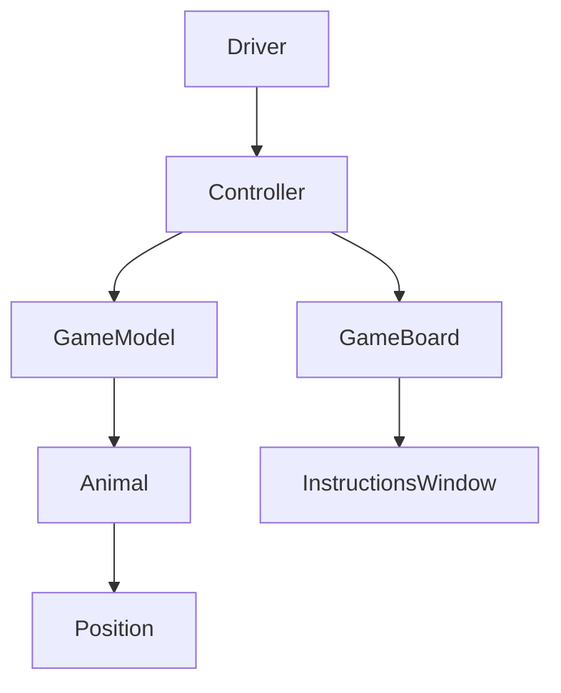

# Jungle Game (Dou Shou Qi)

A Java implementation of the traditional Chinese board game Dou Shou Qi (斗兽棋), also known as Jungle Chess or Animal Chess.

## Description

This is a strategic board game where two players control different animal pieces, each with unique movement abilities and rankings. The goal is to either capture all opponent's pieces or successfully move a piece into the opponent's den.

## Features

- Graphical User Interface (GUI) implementation
- Animal pieces with unique rankings and abilities
- Special board tiles (river, trap, den)
- Two-player gameplay
- Move validation system
- Visual representations for all game pieces

## Game Rules

- Each animal has a rank (1-8)
- Higher ranked animals can capture lower ranked ones
- Special rules for river crossing and trap tiles
- Mouse(Rat) can swim in rivers
- Lions and Tigers can jump across rivers
- Animals become weaker in opponent's traps

## How to Run

1. Make sure you have Java installed on your system
2. Navigate to the src directory
```bash
cd src
```
3. Compile the Java files
```bash
javac */*.java *.java
```
4. Run the game
```bash
java Driver
```

## Project Structure

```
src/
├── Driver.java
├── controller/
│   └── Controller.java
├── model/
│   ├── Animal.java
│   ├── GameModel.java
│   └── [Other animal classes]
├── view/
│   ├── GameBoard.java
│   └── InstructionsWindow.java
├── BLUE/
│   └── [Blue team images]
├── RED/
│   └── [Red team images]
└── NEUTRAL/
    └── [Board tile images]
```
# Technical Documentation

## Object-Oriented Programming Concepts Implementation

### 1. Abstraction
- **Abstract Class**: `Animal.java`
  - Serves as the base class for all animal pieces
  - Contains abstract method `isValidCapture()`
  - Hides implementation details of movement and capture mechanics
  - Provides common attributes like position, rank, and team

### 2. Inheritance
- **Class Hierarchy**:
  ```
  Animal (Abstract)
  ├── Mouse
  ├── Cat
  ├── Dog
  ├── Wolf
  ├── Leopard
  ├── Tiger
  ├── Lion
  └── Elephant
  ```
- Each animal extends the `Animal` class
- Inherits common properties and methods
- Overrides specific behaviors like movement rules

### 3. Encapsulation
- **Private/Protected Members**:
  - Protected attributes in `Animal` class:
    ```java
    protected boolean isAlive;
    protected Position position;
    protected boolean team;
    protected ImageIcon icon;
    protected int rank;
    ```
  - Public getter/setter methods for controlled access
  - Data hiding implemented throughout model classes

### 4. Polymorphism
- **Method Overriding**:
  - `isValidCapture()` implemented differently for each animal
  - `toString()` and `equals()` methods overridden
  - Movement rules customized per animal type
- **Runtime Polymorphism**:
  - Animals stored in arrays/collections as base type
  - Specific behavior determined at runtime

### 5. Design Patterns
- **MVC Pattern**:
  ```
  Model (model/)
  ├── GameModel.java
  ├── Animal.java
  └── Player.java
  
  View (view/)
  ├── GameBoard.java
  └── InstructionsWindow.java
  
  Controller (controller/)
  └── Controller.java
  ```
- **Singleton Pattern**:
  - Used in game state management
- **Observer Pattern**:
  - For GUI updates based on model changes

### 6. Exception Handling
- Custom exception: `RiverJumpException`
- Used for special movement rules
- Proper error handling for illegal moves

### 7. Interfaces & Packages
- Organized in logical packages:
  - `model`: Game logic and data structures
  - `view`: GUI components
  - `controller`: Game flow control
  - Package-level documentation via `package-info.java`

### 8. Collection Framework
- Arrays and Lists used for:
  - Managing game pieces
  - Tracking valid moves
  - Storing game state

## Technical Requirements

### Development Environment
- Java Development Kit (JDK) 8 or higher
- IDE support for Java Swing
- Project built using Java Swing for GUI

### Class Dependencies


### Memory Management
- Efficient object creation
- Proper resource handling
- Image loading optimization

## Code Quality Features

### 1. Documentation
- Comprehensive JavaDoc comments
- Method and class documentation
- In-line comments for complex logic

### 2. Code Organization
- Clear package structure
- Consistent naming conventions
- Separation of concerns

### 3. Testing Considerations
- Modular design for testability
- Clear interface boundaries
- State validation methods

## Performance Considerations

### 1. Resource Management
- Efficient image loading
- Memory-conscious object creation
- Proper cleanup procedures

### 2. GUI Optimization
- Event-driven architecture
- Responsive user interface
- Efficient repainting

## Future Enhancements
1. Network multiplayer support
2. AI opponent implementation
3. Game state persistence
4. Advanced animation effects
5. Sound effects and background music

## Technical Notes
- Uses Java Swing for GUI
- Event-driven programming model
- File I/O for image resources
- Custom coordinate system for game board

## Authors

- Airon John Cruz

## Version

1.0

## License

This project is licensed under the terms specified in the LICENSE file.

## Acknowledgments

- Original Chinese board game: Dou Shou Qi (斗兽棋)
- Images and assets used in this project
